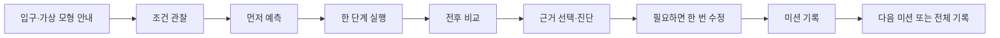

# 공기 부피 압축 연구소 전체 리디자인 계획

> 작성일: 2026-08-30 (Asia/Seoul)
>
> 현재 상태: **리디자인 구현·자동 검증·브라우저 검증 완료, 사람 검토 대기**. 초기 사전 점검에서 한 차례 중단했지만, 사용자가 `$ui-ux-pro-max`를 명시적으로 호출하고 스킬 전문을 제공하여 2026-08-30에 디자인 시스템 검색·검증·저장을 재개했습니다. 아래 초기 차단 기록은 당시의 사실로 보존합니다.

## 1. 실행 범위와 게이트

사용자 요청은 기존 교육용 React 앱의 전체 리디자인입니다. 기본 모드는 `full`로 해석하되, 리디자인 스킬의 필수 하위 스킬을 실제 런타임에서 확인한 뒤 진행하도록 했습니다.

| 역할 | 런타임 확인 | 실제 지침 경로 | 읽은 시점 | 이번 실행 |
|---|---|---|---|---|
| 상위 오케스트레이션 | available | `/Users/kimhongnyeon/.codex/skills/education-webapp-redesign/SKILL.md` | 2026-08-30 | 읽음 |
| 초기·최종 UI 검수 | available | `/Users/kimhongnyeon/.codex/skills/impeccable/SKILL.md` | 2026-08-30 | 읽음, `context.mjs` 실행 |
| 기존 코드 구현 | available | `/Users/kimhongnyeon/.codex/skills/redesign-existing-projects/SKILL.md` | 2026-08-30 | 읽음, 구현 호출 보류 |
| 이미지 자산 | available | `/Users/kimhongnyeon/.codex/skills/imagegen/SKILL.md` | 2026-08-30 | 읽음, 생성 호출 보류 |
| 이미지 안전 규칙 | required reference | `/Users/kimhongnyeon/.codex/skills/education-webapp-redesign/references/asset-safety.md` | 2026-08-30 | 읽음 |
| 디자인 시스템 | user-activated / read | `/Users/kimhongnyeon/.agents/skills/ui-ux-pro-max/SKILL.md` | 2026-08-30 | 검색·검증·저장 완료 |

초기 실행에서는 `$ui-ux-pro-max`와 같은 이름의 파일이 디스크에 존재하는 것만으로 런타임 등록을 추정하지 않고 구현을 중단했습니다. 이후 사용자가 해당 스킬을 명시적으로 활성화하고 전문을 제공했으므로, 이제 그 지침에 따라 디자인 검색과 구현을 진행합니다.

### 재개된 디자인 시스템 게이트

- 시스템 검색: `classroom science experiment interface student --design-system`.
- 결과 검증: **Immersive/Interactive Experience** 패턴은 단계형 가상 실험과 맞았고, HUD/Sci-Fi·다크·네온 스타일은 프로젝트의 라이트 교육용 계약과 맞지 않아 그대로 적용하지 않았습니다.
- 보조 검색: `keyboard focus multi-step learning --domain ux`, `mobile progressive disclosure evidence --domain ux`, `accessible state-driven classroom activity --stack react`.
- 검색 결과는 진행 표시, 가시적 포커스, 포커스 가림 방지, 모바일 우선, 접근성 쿼리 원칙을 구현 기준으로 반영합니다.
- 저장 위치: `design-system/air-compression-rescue-lab/MASTER.md`.
- 저장된 생성 결과에는 프로젝트 오버라이드 섹션을 추가해 밝은 모드·로컬 글꼴·사실 도식·무외부 요청 계약을 명시했습니다.

## 2. 먼저 읽은 프로젝트 기준

적용 가능한 규칙 문서를 저장소와 상위 작업 디렉터리에서 먼저 검색했습니다.

| 문서 | 결과 | 처리 |
|---|---|---|
| 저장소·상위 작업 디렉터리의 `AGENTS.md` | 없음 | 추측하지 않음 |
| `EDUCATION_DESIGN.md` | 없음 | 추측하지 않음 |
| `design-system/MASTER.md` | 루트에는 없음 | 활성화 후 `design-system/air-compression-rescue-lab/MASTER.md`로 저장 |
| `README.md` | 있음 | Vite/React/TypeScript, 무저장, 6개 미션, 기존 공개 URL 확인 |
| `2026-08-28-air-compression-rescue-lab-implementation-plan.md` | 있음 | 과거 구현 계획으로 보존; 현재 상태 기준으로 덮어쓰지 않음 |
| `docs/content-review.md` | 있음 | 6개 고정 미션과 모형 한계 보존 |
| `docs/image-rights-ledger.md` | 있음 | 기존 일반 장식 이미지와 권리 기록 보존 |
| `docs/qa/acceptance-checklist.md` | 있음 | 자동·사람 검수·VoiceOver 제외 경계 보존 |

### 현재 저장소 기준

- 루트: `/Volumes/ External Drive 256G/Dev2/codex/air-compression-rescue-lab`
- Git 시작 상태: `main`, `eed1f1a docs: record HVC gallery registration and sync evidence`
- 시작 시 작업 트리: clean
- 프레임워크: Vite + React 18 + TypeScript, Next.js가 아님
- 패키지 매니저: npm (`package-lock.json`)
- 라우트: 정적 단일 페이지 `/`, production base `/air-compression-rescue-lab/`
- 데이터: 고정된 6개 미션, 런타임 무작위 생성 없음
- 개인정보 경계: 이름·학급·로그인·서버·분석·쿠키·localStorage·sessionStorage·외부 요청 없음
- 학생 대상 음성 기능: 없음; 리디자인에서도 TTS·내레이션·재생·녹음을 추가하지 않음
- 테마: 밝은 교실용 라이트 모드 고정; `prefers-color-scheme: dark`를 추가하지 않음

## 3. 보존해야 할 제품·학습 계약

### 학습자 흐름



| 상태 | 현재 타입·진입점 | 리디자인 계약 |
|---|---|---|
| 입구 | `SessionStep = INTRO`, `EntranceScreen` | 학습 목표·가상 모형 한계·무저장 안내·시작 CTA를 첫 화면에서 이해 |
| 조건 관찰 | `OBSERVE`, `SyringeWorkbench` | 끝 상태·모형 부피·표식 수·간격을 먼저 읽고 예측 CTA로 이동 |
| 예측 | `PREDICT` | 압축·팽창·빠져나감·정보 부족을 아동이 구분 가능한 선택으로 표시 |
| 실행 | `RUN` | 전이표에 있는 한 단계만 실행; 실제 주사기 조작 지시를 만들지 않음 |
| 비교 | `COMPARE` | 부피·표식 수·간격·저항 느낌을 같은 전후 구조로 비교 |
| 진단 | `DIAGNOSE` | 관찰 근거와 선택 판단의 일치 여부를 명시; 오답은 정답을 즉시 노출하지 않음 |
| 수정 | `REVISE` | 잘못된 판단에 한 번의 근거 재확인 기회 제공 |
| 기록 | `REPORT` | 최초 판단 → 근거 → 최종 판단을 보여 주고 점수·순위는 만들지 않음 |

### 보존 대상 데이터와 순수 판정

- `src/domain/types.ts`의 `MissionId`, `SealState`, `AirDecision`, `AirState`, `AirMission`, `SessionStep` 계약을 유지합니다.
- `src/domain/airModel.ts`의 전이표 조회와 `simulateAirCase()`, `validateConservation()`, `compareAirStates()`, `evaluateDiagnosis()`를 정오 판정의 단일 경계로 유지합니다.
- `src/content/missions.ts`의 6개 ID와 승인된 상태 fixture를 변경하지 않습니다.
- `src/app/sessionReducer.ts`의 무작위 생성 없는 세션, 뒤로 가기 시 응답 보존, 새로고침 시 복구하지 않는 원칙을 유지합니다.

## 4. 리디자인 방향 초안

아래 브리프는 `$ui-ux-pro-max` 검색 결과와 프로젝트 계약을 조정해 확정한 구현 방향입니다. 생성 결과의 어두운 HUD 기본값은 프로젝트 오버라이드로 제외했습니다.

- 제품별 시각 언어: **관찰 노트 위에 놓인 밝은 가상 실험대**. 화면의 주인공은 추상적인 카드가 아니라 “같은 표식이 더 좁거나 넓은 공간에 놓이는 변화”입니다.
- 첫 뷰포트: 앱 이름·오늘의 학습 목표·가상 모형 주사기 SVG·시작 CTA·무저장 안내를 한 덩어리로 배치합니다. 미션 6개 목록과 긴 설명은 접거나 아래로 내려 첫 행동을 가리지 않게 합니다.
- 작업 화면: 데스크톱에서는 `상태/관찰`과 `현재 행동`을 나란히, 모바일에서는 `현재 할 일 → 도식 → 근거/선택 → CTA` 순서로 쌓습니다.
- 결과 화면: 긴 단일 표에만 의존하지 않고 미션별 기록 블록을 사용하되, 인쇄용 표 구조와 의미 있는 `<table>`은 유지할지 시스템 설계 단계에서 결정합니다.
- 색상: 라이트 모드 안에서 한 개의 주 강조색과 명확한 상태색을 정의하고, 색만으로 정답·선택 상태를 전달하지 않습니다.
- 도식: 과학적으로 승인된 값은 프로그램 SVG로 유지합니다. 장식 이미지가 표식 수·부피·정답을 대신 표현하지 않게 합니다.
- 모션: `gi-pulse`는 입구 시작, 단계별 필수 실행/확인 등 실제 다음 행동에만 적용하고 `prefers-reduced-motion: reduce`에서는 정적 테두리와 `필수` 표시로 대체합니다.
- 공통 chrome: 상단의 작은 `업데이트 내역` 버튼, 건너뛰기 링크, 현재 단계, 뒤로 가기, 새로고침 시 기록 소실 안내를 일관되게 제공합니다.

## 5. 예상 변경 파일과 책임

코드 구현은 게이트가 풀린 뒤 진행합니다. 기존 스택을 유지하고, 한 파일 500줄 미만을 지킵니다.

| 영역 | 후보 경로 | 계획된 책임 |
|---|---|---|
| 앱 셸 | `src/app/App.tsx` | 현재 단계 heading의 초점·스크롤, skip link, 전역 layout, restart 대화상자 경계 |
| 상태 | `src/app/sessionReducer.ts` | 기존 전이와 기록을 보존; 필요한 경우 UI가 요구하는 뒤로 가기·완료 잠금 테스트만 보강 |
| 공통 컴포넌트 | `src/components/ActionButton.tsx`, `ProgressSteps.tsx`, `ModalDialog.tsx` | 버튼 우선순위, 현재/지난 단계, focus trap·복원·모바일 터치 영역 |
| 업데이트 | `src/components/UpdateHistoryButton.tsx`, `UpdateHistoryDialog.tsx`, `src/update/updateHistory.ts` | 현재 날짜와 실제 수정 내역을 추가; 구현 전 기록을 임의로 출시 완료로 바꾸지 않음 |
| 입구 | `src/features/air-lab/EntranceScreen.tsx` | 첫 행동 중심의 정보 구조와 미션 개요 재배치 |
| 학습 화면 | `src/features/air-lab/SyringeWorkbench.tsx` | 단계별 읽기 순서, 선택지, feedback·error·back 상태, 내부 ID 비노출 |
| 도식 | `src/features/air-lab/SyringeFigure.tsx` | 표식이 주사기 안에 실제로 들어오는 responsive SVG와 상태별 캡션 |
| 피드백 | `src/features/air-lab/FeedbackPanel.tsx` | 아동용 관찰 문구 매핑, 오답 회복, 판단 보류 설명 |
| 보고서 | `src/features/report/LearningReport.tsx`, `print.css` | 화면·인쇄 구조, 결과 다음 행동, 긴 문장 모바일 흐름 |
| 토큰·스타일 | `src/styles/tokens.css`, `app.css`, `motion.css` | 승인된 디자인 토큰, responsive grid, focus, reduced motion, 가로 넘침 방지 |
| 문서 메타 | `index.html`, `public/favicon.svg` | base-aware 자산·메타 점검; 로고/마크는 자동 생성하지 않음 |
| 자동 검증 | `src/app/*.test.*`, `tests/**`, `e2e/**` | 기존 학습·프라이버시 계약 보존과 신규 visual/keyboard/mobile 상태 고정 |

## 6. 초기 감사에서 확인한 우선 이슈

세부 근거는 `work/education-webapp-redesign-audit.md`에 남깁니다. 아래 P0/P1은 디자인 시스템이 활성화된 뒤 수용 기준으로 사용합니다.

1. **[P1] 현재 단계 초점이 새 단계 제목이 아니라 숨겨진 전역 H1로 이동** — `src/app/App.tsx:52-79`; 학생이 단계가 바뀌었다는 맥락을 즉시 듣거나 볼 수 없습니다.
2. **[P1] 피드백이 `evidence.from.*`, `evidence.to.*`, `obs.not-enough-information` 같은 내부 키를 노출** — `src/features/air-lab/FeedbackPanel.tsx:40-48`, `SyringeWorkbench.tsx:68-71`; 아동용 문구가 아니라 시스템 ID가 보입니다.
3. **[P1] 입구의 긴 미션·판단 목록 뒤에 시작 CTA가 위치** — `EntranceScreen.tsx:19-72`; 좁은 화면에서 첫 행동과 학습 목표가 묻힙니다.
4. **[P1] SVG 표식 배치가 좁은 부피·큰 간격에서 barrel 밖으로 넘어갈 가능성** — `SyringeFigure.tsx:20-29`; 도식이 승인된 상태를 정확히 보여 주지 못할 수 있습니다.
5. **[P1] `leaking` 상태의 그림이 `sealed` 이외를 모두 열린 출구로 그리는 분기** — `SyringeFigure.tsx:93-107`; 누출과 열림을 시각적으로 구분하지 못합니다.
6. **[P2] reducer에 있는 `BACK`이 학생 UI에 연결되지 않음** — `src/app/sessionReducer.ts:176-180`, 각 화면; 사용자가 막다른 단계에서 이전 근거로 돌아갈 수 없습니다.
7. **[P2] 좁은 화면 표가 내부 가로 스크롤에 의존** — `src/styles/app.css:480-485`; 320px·200% 확대에서 같은 정보를 읽는 대체 흐름이 필요합니다.
8. **[P2] 전역 reduced-motion 규칙이 모든 transition을 0.01ms로 압축** — `src/styles/motion.css:20-34`; 필요한 선택·상태 피드백까지 사라질 수 있어 필수 모션만 정적으로 대체해야 합니다.
9. **[P2] 색·간격·반경이 여러 하드코딩 값으로 흩어져 있음** — `src/styles/tokens.css`, `src/styles/app.css`; 공통 디자인 시스템이 없어 화면 간 일관성 검수 비용이 큽니다.
10. **[P2] `FeedbackPanel`의 `accepted` 상태에서 모형 한계와 관찰 근거가 같은 밀도로 섞임** — `FeedbackPanel.tsx:25-52`; 결과를 먼저 이해하고 다음 행동으로 가는 시선 순서가 필요합니다.

## 7. TDD 구현 순서

디자인 시스템·구현 스킬이 활성화된 뒤, 다음 순서로 실패 테스트 → 최소 구현 → 관련 검증을 반복합니다.

1. **설계 계약 고정**
   - `$ui-ux-pro-max`가 산출한 색상·타이포그래피·간격·반응형·상태·focus 계약을 `design-system/air-compression-rescue-lab/MASTER.md`에 기록합니다.
   - `$impeccable` 초기 감사의 P1을 수용 기준에 매핑합니다.
2. **현재 단계 focus와 navigation**
   - 현재 단계의 실제 heading으로 focus/scroll이 이동하는 테스트를 먼저 추가합니다.
   - skip link, back, restart, modal focus restore를 키보드 테스트로 고정합니다.
3. **표시 문구 경계**
   - 내부 observation/evidence key가 학생 화면에 나타나지 않는 테스트를 먼저 추가합니다.
   - 누출·열림·밀폐를 SVG와 캡션 모두에서 구분하는 테스트를 추가합니다.
4. **입구와 공통 토큰**
   - 첫 viewport에 목표·가상 모형·시작 CTA·무저장 안내가 보이는 DOM/viewport 조건을 고정합니다.
   - 기존 package 의존성만 사용하며 새 폰트·아이콘 라이브러리는 필요성과 번들 영향을 기록한 후 별도 승인합니다.
5. **학습 화면 layout**
   - OBSERVE → PREDICT → RUN → COMPARE → DIAGNOSE → REVISE → REPORT의 행동 순서를 유지합니다.
   - primary CTA는 화면당 하나로 명확히 하고, 실제로 다음 행동이 필요한 버튼에만 `gi-pulse`를 적용합니다.
6. **도식 responsive 수정**
   - 12개 표식이 모든 승인된 spacing/volume 조합에서 SVG 내부에 들어오는 geometry 테스트를 추가합니다.
   - 생성 이미지로 과학 도식을 대체하지 않습니다.
7. **보고서·업데이트 내역**
   - 최초 판단 → 근거 → 최종 판단을 보존하는 화면·인쇄 테스트를 추가합니다.
   - 실제 리디자인이 완료되는 날 `src/update/updateHistory.ts`에 간단한 변경 내역을 앞에 추가합니다.
8. **자산 안전 처리**
   - `public`, `src/assets`, CSS URL, JSX/TSX import, preload/srcset과 fixture를 다시 목록화합니다.
   - 일반 장식 자산이 실제로 개선 대상일 때만 `$imagegen`으로 버전 파일을 만들고, 원본은 유지합니다.
   - 사실·수치·과학 도식·로고·스크린샷은 자동 교체하지 않습니다.
9. **최종 검수와 검증**
   - `$impeccable` 최종 검수, 자동 검증, 브라우저 흐름 검증, 사람 검수 대기를 서로 다른 증거 상태로 기록합니다.

## 8. 수용 기준

### 기능·학습

- 6개 미션 ID와 승인된 판정 결과가 기존과 동일합니다.
- `simulateAirCase()`는 승인된 finite-state transition만 조회하며 새로운 연속 물리식이나 추정을 추가하지 않습니다.
- 밀폐에서는 표식 수가 보존되고, 열린 상태에서는 표식 이동을 구분하며, 누출 정보 부족은 판단 보류로 남습니다.
- 시작 → 관찰 → 예측 → 실행 → 비교 → 진단 → 수정 → 기록 → 다음 미션/전체 기록 흐름을 건너뛰지 않고 완주할 수 있습니다.
- 오답은 정답을 즉시 노출하지 않고 관찰 근거와 한 번의 수정 기회를 제공합니다.
- 학생 화면에 내부 ID, 원시 오류, 가짜 검수/승인/출시 문구를 표시하지 않습니다.

### 시각·반응형·접근성

- 320×568, 375×812, 768×1024, 1280×800에서 첫 행동과 현재 CTA가 긴 설명 아래 묻히지 않습니다.
- 200% 브라우저 확대에서 제목·선택지·표·도식이 읽히고, 의도하지 않은 문서 가로 넘침이 없습니다.
- 버튼·라디오·체크박스·닫기·뒤로 가기는 최소 44×44 CSS px의 조작 영역을 갖습니다.
- `:focus-visible`, 논리적인 Tab/Shift+Tab 순서, Enter/Space 조작, 단계 전환 focus/scroll을 확인합니다.
- 색 외에 텍스트·테두리·선택 표시로 상태를 구분합니다.
- `prefers-reduced-motion: reduce`에서는 `gi-pulse`와 장식 이동을 제거하고 필수 상태·필수 배지를 정적으로 유지합니다.
- 앱은 라이트 모드를 유지하며 VoiceOver 수동 검증은 실행·보고하지 않습니다. 자동 axe 결과와 일반 키보드 검증은 별도로 기록합니다.

### 개인정보·성능·자산

- 런타임 외부 요청, 저장소 쓰기, 쿠키, 로그인, 분석, 마이크·카메라·센서가 0건입니다.
- 생성 자산은 로컬에 버전 파일로 저장되고 원본·프롬프트·역할·alt 결정이 자산 문서와 1:1 대응합니다.
- 과학 도식·측정값·정체성·로고·실제 장소/인물 이미지는 자동 생성·교체하지 않습니다.
- 모든 TS/TSX/CSS 파일은 500줄 미만입니다.

## 9. 기존 검증 명령과 기대 결과

명령은 저장소의 실제 `package.json`에 있는 것만 사용합니다.

```text
npm run lint
npm run typecheck
npm run test:run
npm run test:a11y
npm run check:lines
npm run build
npm run test:e2e
npm run verify
git diff --check
```

기대 결과:

- lint/typecheck/test/a11y/줄 수/build exit 0
- 기존 계약과 신규 검증을 합친 52개 단위·컴포넌트·프라이버시 테스트 통과
- axe serious/critical 0건; jsdom canvas 경고가 남으면 경고 원인과 검사 범위를 별도 기록
- dist에 production base와 모든 HTML 참조 자산 생성
- Playwright는 `4217` 프로젝트 전용 preview 포트로 실행하고, `page.goto('./')` 기준을 유지
- 자동화 성공을 교과 검수·실제 보조공학 승인·공개 배포 완료로 표현하지 않음

## 10. 자산 판정과 롤백

- 현재 목록은 `src/assets/generated/safe-virtual-air-lab.webp`, `public/favicon.svg`, 프로그램으로 그리는 `SyringeFigure` SVG, HVC 캡처입니다.
- `safe-virtual-air-lab.webp`는 입구 분위기용 일반 장식 자산이므로, 품질·비율·맥락이 실제로 부족할 때만 `safe-virtual-air-lab-v2.webp` 후보를 생성합니다. 생성 전 `$imagegen`과 `asset-safety.md`를 다시 적용합니다.
- 주사기 단면·피스톤·표식은 정보성 과학 도식이므로 생성 이미지로 교체하지 않습니다.
- 원본 파일은 삭제·덮어쓰지 않습니다. 실패 시 import/CSS/HTML 참조를 이전 파일명으로 되돌리고 자산 장부의 상태를 복원합니다.
- 구현 변경은 별도 커밋 없이 진행되며, 검토 전 `git diff -- <변경 파일>`로 범위를 확인하고 필요 시 변경 파일만 수동 역패치합니다.
- 커밋·푸시·릴리스·Pages 재배포·HVC 등록/수정은 이 요청 범위에 포함하지 않습니다.

## 11. 현재 차단과 재개 조건

초기 차단은 종료되었습니다. 사용자가 `$ui-ux-pro-max`를 명시적으로 활성화했고, 전문을 읽은 뒤 디자인 시스템을 저장했습니다. 구현과 자동·브라우저 검증까지 완료했으며, 교과·물리 화면 검토만 남아 있습니다.

재개 후 순서:

1. `$ui-ux-pro-max`의 실제 `SKILL.md`와 React 스택 규칙을 읽었습니다.
2. 이 계획과 `work/education-webapp-redesign-audit.md`를 입력으로 디자인 시스템을 확정·저장했습니다.
3. 코드 수정·자산 판정·자동 검증·브라우저 검증 결과를 `work/education-webapp-redesign-report.md`에 추가했습니다.

## 12. 구현 후 기록

- 앱 셸에 skip link, 브랜드 마크, 업데이트 내역, 현재 단계 제목 focus/scroll을 연결했습니다.
- 입구를 목표·가상 관찰 도구·시작 CTA 중심으로 재배치하고, 미션 목록과 판단 어휘를 아래 개요로 분리했습니다.
- `SyringeWorkbench`를 관찰 → 예측 → 실행 → 비교 → 진단 → 수정 → 기록의 단계형 화면으로 정리하고, 뒤로 가기·근거 문구·오답 회복을 연결했습니다.
- `SyringeFigure`의 승인 상태 geometry를 safe area 안에 고정하고, 밀폐·열림·누출 도식을 분리했습니다.
- 2026-08-30 업데이트 내역과 라이트 모드 토큰, responsive/mobile/reduced-motion 스타일을 추가했습니다. 모든 TS/TSX/CSS 파일은 500줄 미만입니다.
- 이미지·폰트·외부 요청·저장소·의존성은 추가하지 않았습니다. 기존 생성 장식 자산은 1280px/375px 브라우저 화면에서 역할과 비율을 확인한 뒤 유지했습니다.
- 개별 `npm run test:e2e`는 7/7 통과했습니다. 마지막 `npm run verify`는 앞선 정적·unit·a11y·줄 수 단계 통과 후 macOS Chromium child launch 권한 오류로 E2E 묶음에서 중단되어, verify 전체 PASS로 표현하지 않습니다.
- 최종 근거는 `work/education-webapp-redesign-report.md`에 명령별 결과와 사람 검토 대기로 분리해 기록합니다.
